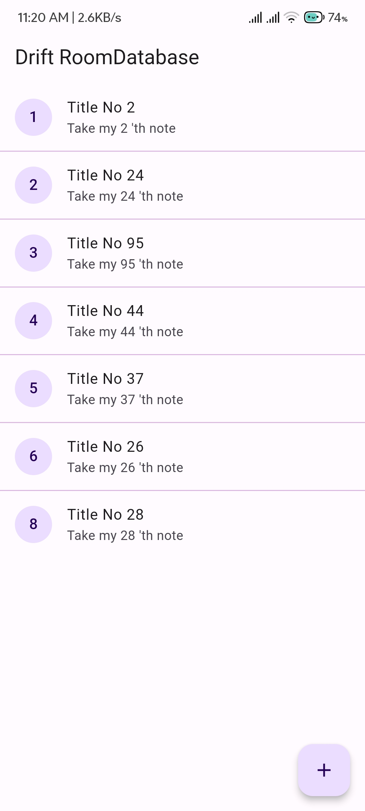

# Drift for Room Database

Drift is a powerful database library for Dart and Flutter applications. To support its advanced capabilities like type-safe SQL queries, verification of your database and migrations, it uses a builder and command-line tooling that runs at compile-time.

"Room" refers to a persistence library provided by Google for Android app development. Room is part of the Android Jetpack architecture components and offers an abstraction layer over SQLite to make database operations on Android more straightforward and efficient.

Key components of the Room database include:

Entity: Annotated classes that define the database schema. Each entity corresponds to a table in the database, and each instance of the entity represents a row in that table.

Database: An abstract class that extends RoomDatabase. It serves as the main access point for the underlying SQLite database. The @Database annotation defines the database settings, including the list of entities and the version number.

DAO (Data Access Object): Interface or abstract class annotated with @Dao that contains methods for accessing the database. These methods are used to perform various CRUD (Create, Read, Update, Delete) operations on the entities.

Type Converters: Room provides default type converters for common data types, but you can also define custom type converters for handling non-primitive types.

I provided a brief overview of how Room works:

## How to Use [3-Step]
All you need to know about adding drift to your project.

1. Creating Entity
Annotations or decorators to specify how the entity should be mapped to the database.

3. Create a DatabaseClass for Drift
To work with Drift in your project, Now, you'll need a DatabaseClass that serves as the main connection to the database. This class should include references to all the tables you intend to use and acts as the main point for Drift's code generation.

4. Create a Database Repository and Query Functions and Generate.
   
   **Generate Code**

    ```bash
    dart run build_runner build -d  
    ```
6. Congratulations!!! You are ready to use AppDatabase.


## Cookbook of Drift

[Drift](https://drift.simonbinder.eu/docs/getting-started/)

## 	🧑🏿‍💻 CheatSheet
### **1\. Setting Up Drift**

**Add Dependencies:**

```yaml
dependencies:
  drift: ^<latest_version>
  sqlite3_flutter_libs: ^<latest_version>
  path_provider: ^<latest_version>

dev_dependencies:
  drift_dev: ^<latest_version>
  build_runner: ^<latest_version>
```

### **2\. Defining Tables**

**Creating a Table:**

```dart
import 'package:drift/drift.dart';

class Songs extends Table {
  IntColumn get id => integer().autoIncrement()(); // Primary Key
  TextColumn get title => text()();
  TextColumn get artist => text().nullable()();
  RealColumn get durationMs => real()();
  TextColumn get album => text().nullable()();
  TextColumn get genre => text().nullable()();
  TextColumn get folder => text()();
  // Use BlobColumn for binary data for the picture (e.g., album art)
  BlobColumn get picture => blob().named('picture')();
  // Text column for the title, cannot be null
  TextColumn get title => text().named('title').customConstraint('NOT NULL')();
  //boolean value
  BoolColumn get isFavorite => boolean().named('isFavorite')();
  DateTimeColumn get edited => dateTime().named('edited')();
}
```

### **3\. Setting Up the Database**

**Creating the Database Class:**

```dart
import 'package:drift/drift.dart';
import 'package:drift/native.dart';
import 'package:path_provider/path_provider.dart';
import 'package:path/path.dart' as p;
import 'dart:io';

part 'app_database.g.dart'; // Generated file

LazyDatabase _openConnection() {
  return LazyDatabase(() async {
    // Will create the db on Document Directory as app.sqlite
    final dbFolder = await getApplicationDocumentsDirectory();
    final file = File(p.join(dbFolder.path, 'app.sqlite'));
    return NativeDatabase(file);
  });
}
//Tables can be seperated by comma.
@DriftDatabase(tables: [Songs])
class AppDatabase extends _$AppDatabase {
  AppDatabase() : super(_openConnection());

  @override
  int get schemaVersion => 1;
}
```

### **4\. Inserting Data**

**Insert a Single Row:**

```dart
Future<int> insertSong(SongsCompanion song) {
  return into(songs).insert(song);
}

final song = SongsCompanion(
  title: Value('Song Title'),
  artist: Value('Artist Name'),
  durationMs: Value(210000.0),
  album: Value('Album Name'),
  genre: Value('Genre'),
  folder: Value('/music/folder'),
);

await insertSong(song);
```

**Insert Multiple Rows:**

```dart
Future<void> insertSongs(List<SongsCompanion> songList) async {
  await batch((batch) {
    batch.insertAll(songs, songList);
  });
}
```

### **5\. Querying Data**

**Get All Rows:**

```dart
Future<List<Song>> getAllSongs() {
  return select(songs).get();
}
```

**Get a Specific Row by Condition:**

```dart
Future<Song?> getSongById(int id) {
  return (select(songs)..where((tbl) => tbl.id.equals(id))).getSingleOrNull();
}
```

**Query with Multiple Conditions:**

```dart
Future<List<Song>> getSongsByArtistAndAlbum(String artist, String album) {
  return (select(songs)
    ..where((tbl) => tbl.artist.equals(artist))
    ..where((tbl) => tbl.album.equals(album))
  ).get();
}
```

**Query with Sorting:**

```dart
Future<List<Song>> getAllSongsSortedByTitle() {
  return (select(songs)
    ..orderBy([
      (tbl) => OrderingTerm(expression: tbl.title, mode: OrderingMode.asc)
    ])
  ).get();
}
```

**Get Distinct Values:**

```dart
Future<List<String>> getAllDistinctArtists() {
  return (selectOnly(songs, distinct: true)
    ..addColumns([songs.artist])
  ).map((row) => row.read(songs.artist)!).get();
}
```

### **6\. Updating Data**

**Update a Single Row:**

```dart
Future<bool> updateSong(Song song) {
  return update(songs).replace(song);
}
```

**Update Specific Fields:**

```dart
Future<int> updateSongTitle(int id, String newTitle) {
  return (update(songs)
    ..where((tbl) => tbl.id.equals(id))
  ).write(SongsCompanion(
    title: Value(newTitle),
  ));
}
```

### **7\. Deleting Data**

**Delete a Single Row:**

```dart
Future<int> deleteSongById(int id) {
  return (delete(songs)..where((tbl) => tbl.id.equals(id))).go();
}
```

**Delete Multiple Rows:**

```dart
Future<int> deleteSongsByArtist(String artist) {
  return (delete(songs)..where((tbl) => tbl.artist.equals(artist))).go();
}
```

**Delete All Rows:**

```dart
Future<int> deleteAllSongs() {
  return delete(songs).go();
}
```

### **8\. Batch Operations**

**Inserting, Updating, or Deleting in Batch:**

```dart
Future<void> performBatchOperations(List<SongsCompanion> newSongs, int songIdToUpdate) async {
  await batch((batch) {
    batch.insertAll(songs, newSongs);
    batch.update(songs, SongsCompanion(title: Value('Updated Title')),
      where: (tbl) => tbl.id.equals(songIdToUpdate));
    batch.deleteWhere(songs, (tbl) => tbl.artist.equals('Artist Name'));
  });
}
```

### **9\. Database Migration**

**Add a Migration:**

```dart
@override
MigrationStrategy get migration => MigrationStrategy(
  onUpgrade: (migrator, from, to) async {
    if (from == 1) {
      await migrator.addColumn(songs, songs.newColumn);
    }
  },
);
```

### **10\. Closing the Database**

**Close the Database:**

```dart
Future<void> closeDatabase() async {
  await _db.close();
}
```

### **11\. Running the Generator**

**Run the Drift Code Generator:**

```bash
flutter pub run build_runner build
```

### **12\. Advanced Queries**

**Joins:**

```dart
Future<List<SongWithArtist>> getSongsWithArtist() {
  final query = select(songs).join([
    innerJoin(artists, artists.id.equalsExp(songs.artistId)),
  ]);

  return query.map((row) {
    return SongWithArtist(
      song: row.readTable(songs),
      artist: row.readTable(artists),
    );
  }).get();
}
```

**Aggregates (e.g., Counting Rows):**

```dart
Future<int> getSongCount() {
  return (selectOnly(songs)..addColumns([songs.id.count()])).map((row) => row.read<int>(songs.id.count())!).getSingle();
}
```

### **13\. Handling Null Values**

**Handling Nullable Columns:**

```dart
Future<List<String>> getAllGenres() async {
  final queryResult = await (selectOnly(songs, distinct: true)
    ..addColumns([songs.genre])
  ).map((row) => row.read(songs.genre)).get();

  return queryResult.whereType<String>().toList(); // Filters out null values
}
```

### **14\. Error Handling**

**Try-Catch Block:**

```dart
try {
  final songs = await getAllSongs();
  // Use the songs
} catch (e) {
  print('Error: $e');
}
```

### **15\. Debugging**

**Enabling Logging:**

```dart
@override
StreamQueryUpdateRules get streamUpdateRules => StreamQueryUpdateRules([
  // Log all queries
]);

@override
QueryExecutor createExecutor() {
  return NativeDatabase.memory(logStatements: true);
}
```

This cheat sheet covers the most common operations you'll need while working with Drift. It provides a solid foundation for managing and querying your SQLite database in a Flutter app, If you like it, please give an Star.


## Screenshots




## 🚀  Follow
[](https://arrahmanbd.github.io/)
[](https://www.linkedin.com/in/arrahmanbd)
[](https://www.github.com/arrahmanbd)


## Badges


[](https://choosealicense.com/licenses/mit/)
[](https://opensource.org/licenses/)
[](http://www.gnu.org/licenses/agpl-3.0)

